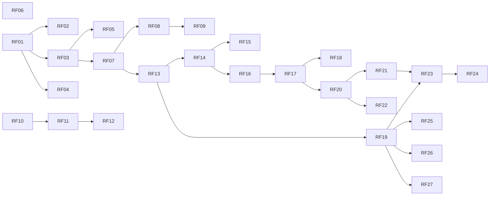

# Documento de Requisitos — ÁgoraHub

| Versão | Responsável     | Data       | Alterações                                                                                                                                                        |
|--------|-----------------|------------|-------------------------------------------------------------------------------------------------------------------------------------------------------------------|
| 1.0    | Equipe ÁgoraHub | 06/10/2026 | Primeira versão: propósito, usuários, glossário, solução proposta, requisitos do MVP e da versão completa, relação entre funcionalidades e requisitos, e decisões |
| 2.0    | Equipe ÁgoraHub | 07/10/2026 | Revisão completa: requisitos organizados por funcionalidade, com novos identificadores; vocabulário das telas; decisões D04 a D12                                 |

## Sumário

1. [Introdução](#1-introdução)
2. [Propósito do sistema](#2-propósito-do-sistema)
3. [Usuários](#3-usuários)
   - [3.1 Tipos de usuário](#31-tipos-de-usuário)
   - [3.2 Papéis do estudante](#32-papéis-do-estudante)
   - [3.3 Protopersonas](#33-protopersonas)
4. [Glossário](#4-glossário)
5. [Solução proposta](#5-solução-proposta)
   - [5.1 Como o ÁgoraHub responde aos problemas](#51-como-o-ágorahub-responde-aos-problemas)
   - [5.2 Funcionalidades do MVP](#52-funcionalidades-do-mvp)
   - [5.3 Navegação](#53-navegação)
   - [5.4 O que fica para a versão completa](#54-o-que-fica-para-a-versão-completa)
6. [Requisitos do MVP](#6-requisitos-do-mvp)
   - [6.1 Requisitos funcionais](#61-requisitos-funcionais)
   - [6.2 Regras de negócio](#62-regras-de-negócio)
   - [6.3 Requisitos não funcionais](#63-requisitos-não-funcionais)
7. [Requisitos da versão completa](#7-requisitos-da-versão-completa)
8. [Decisões](#8-decisões)
   - [8.1 Decisões em aberto](#81-decisões-em-aberto)
   - [8.2 Decisões tomadas](#82-decisões-tomadas)

## 1. Introdução

Este documento apresenta os requisitos do aplicativo **ÁgoraHub**, projeto acadêmico das disciplinas de Projeto Integrador e Programação para Dispositivos Móveis (Sistemas de Informação, IFAL Arapiraca, 2026.2).

Os requisitos estão divididos em duas partes:

- **MVP do semestre:** o que a equipe vai construir até dezembro de 2026, com os conceitos vistos nas aulas e as exceções previstas na RNF11.
- **Versão completa:** o que o app precisaria ter para ser usado de verdade pelos estudantes. Fica registrado para não perder a visão do produto, mas não faz parte da entrega do semestre.

O documento está organizado assim: a seção 2 descreve o propósito do sistema; a seção 3, os usuários; a seção 4, o glossário; a seção 5, a solução proposta e a navegação; a seção 6, os requisitos do MVP, organizados por funcionalidade; a seção 7, os requisitos da versão completa; e a seção 8 registra as decisões do projeto.

## 2. Propósito do sistema

No curso de Sistemas de Informação do IFAL Arapiraca, editais, bolsas, hackathons e eventos chegam aos estudantes espalhados por e-mails, murais e grupos de WhatsApp, e muitos só ficam sabendo depois do prazo. Formar equipe também é difícil: quem tem uma ideia não sabe quem tem interesse ou habilidade para ajudar, e muitos estudantes evitam abordar colegas que não conhecem. Além disso, boa parte da turma concilia os estudos com trabalho, família ou longos deslocamentos e passa pouco tempo no campus.

Em setembro de 2026, a equipe aplicou um questionário à comunidade acadêmica do curso e recebeu 33 respostas (31 estudantes e 2 professores ou membros da coordenação). Entre os respondentes:

- 10 já deixaram de participar de uma oportunidade por não encontrar colegas para formar equipe, e outros 9 por causa de avisos perdidos (5) ou porque souberam depois do prazo (4);
- 27 apontaram um mural com editais, vagas e desafios como uma das funcionalidades que mais os fariam usar a plataforma, e 20 escolheram a possibilidade de iniciar um projeto com outros estudantes;
- 21 preferem encontrar parceiros por interesse comum em áreas específicas, como desenvolvimento web, dados ou UX/UI;
- 17 conciliam os estudos com trabalho, família ou longos deslocamentos;
- 22 acham que a falta de ferramentas acessíveis atrapalha muito a integração dos alunos, e 10 que atrapalha um pouco; 2 respondentes usam recursos de acessibilidade e 21 conhecem colegas que precisam.

Nas respostas abertas, os participantes disseram que não usariam uma plataforma com excesso de informação ou parecida com os grupos de WhatsApp que já existem.

Como a amostra é pequena, esses números indicam tendências e não representam todo o curso.

O propósito do ÁgoraHub é reunir, num só aplicativo Android, **as oportunidades acadêmicas e a formação de equipes de projeto** entre estudantes do IFAL, organizadas por áreas de interesse, com o estudante no controle de quando o seu contato é compartilhado.

A pesquisa também mostrou que 17 respondentes têm dificuldade para tirar dúvidas sobre as disciplinas, por não saberem quem domina o assunto (9) ou por receio de perguntar em grupos grandes (8). Esse problema é real, mas não faz parte do foco do MVP e está registrado como possível evolução.

## 3. Usuários

### 3.1 Tipos de usuário

| Tipo de usuário | Descrição                                                                                                                                                                         | No MVP?               |
|-----------------|-----------------------------------------------------------------------------------------------------------------------------------------------------------------------------------|-----------------------|
| Estudante       | Aluno do IFAL com e-mail institucional (`@aluno.ifal.edu.br`). Consulta o Mural de Oportunidades, cria projetos no Hub de Projetos e pede para participar de projetos de colegas. | Sim                   |
| Equipe ÁgoraHub | Integrantes da equipe que mantêm o Mural de Oportunidades atualizado. No MVP, cadastram as oportunidades fora do aplicativo, pelo console do Firebase.                            | Sim, fora do app      |
| Administrador   | Publica e remove oportunidades pelo próprio aplicativo.                                                                                                                           | Não (versão completa) |
| Professor       | Divulga desafios e oportunidades e acompanha a participação dos estudantes.                                                                                                       | Não (versão completa) |

### 3.2 Papéis do estudante

O mesmo estudante pode assumir dois papéis, dependendo da situação:

| Papel                    | Quando                                                    | O que pode fazer                                                                                                                                           |
|--------------------------|-----------------------------------------------------------|------------------------------------------------------------------------------------------------------------------------------------------------------------|
| Responsável pelo projeto | Quando cria um projeto                                    | Ver as solicitações recebidas, aceitar ou recusar, ver o e-mail dos membros, editar o título e a descrição, remover membros, reabrir e encerrar o projeto. |
| Solicitante              | Quando pede para participar do projeto de outro estudante | Enviar a solicitação e acompanhar o status.                                                                                                                |

### 3.3 Protopersonas

Pessoas fictícias criadas a partir da pesquisa, usadas para orientar as decisões do produto.

| Protopersona      | Quem é                                                                  | O que espera do ÁgoraHub                                                           | Atendida no MVP?                                                                                   |
|-------------------|-------------------------------------------------------------------------|------------------------------------------------------------------------------------|----------------------------------------------------------------------------------------------------|
| Marina, 21        | Estuda IA e UX por conta própria, mas não tem com quem montar projetos. | Saber das oportunidades a tempo e encontrar colegas com interesses complementares. | Sim                                                                                                |
| Pedro, 18         | Calouro tímido, não sabe como se aproximar dos grupos.                  | Entrar em projetos sem precisar dar o primeiro passo "no escuro".                  | Sim                                                                                                |
| John, 19          | Mora longe e passa pouco tempo no campus.                               | Se conectar com colegas e projetos sem depender de estar no campus.                | Sim                                                                                                |
| Isabela, 22       | Usa leitor de tela.                                                     | Um app acessível desde o primeiro acesso.                                          | Sim, com leitor de tela; a navegação completa por teclado fica para a versão completa              |
| Camila, 20        | Tem ansiedade social e evita se expor em grupos.                        | Se conectar aos poucos, sem exposição imediata.                                    | Em parte: pede para entrar num projeto de forma discreta; pedir ajuda com dúvidas fica fora do MVP |
| Roberta, 26       | Voltou de licença-maternidade e não conhece a turma nova.               | Encontrar parceiros e colaborar a distância.                                       | Em parte: encontra projetos por interesse; grupos de estudo ficam fora do MVP                      |
| Théo, 23          | Veterano que ajuda colegas pelo WhatsApp e se sente sobrecarregado.     | Um espaço organizado para oferecer ajuda.                                          | Não (versão completa)                                                                              |
| Prof. Ricardo, 41 | Professor que quer engajar os alunos em desafios.                       | Um canal para divulgar desafios e acompanhar a participação.                       | Não (versão completa)                                                                              |

## 4. Glossário

Termos usados neste documento, em ordem alfabética.

| Termo                    | Significado                                                                                                                                                                                  |
|--------------------------|----------------------------------------------------------------------------------------------------------------------------------------------------------------------------------------------|
| Data de publicação       | Data em que a Equipe ÁgoraHub cadastrou a oportunidade. Aparece nos detalhes da oportunidade, não no mural.                                                                                  |
| E-mail institucional     | Endereço do domínio `@aluno.ifal.edu.br`. É o único aceito no cadastro de estudantes.                                                                                                        |
| Equipe ÁgoraHub          | Integrantes da equipe do projeto. Cadastram as oportunidades do mural e atendem pedidos de exclusão de conta.                                                                                |
| Hub de Projetos          | Lista dos projetos abertos que ainda têm vagas disponíveis, mostrada na aba Projetos.                                                                                                        |
| Interesse                | Área de habilidade ou interesse, como Mobile, UX/UI ou Banco de Dados, escolhida da lista de interesses. Aparece no perfil do estudante e nos projetos.                                      |
| Interesses procurados    | Interesses que o responsável procura em quem vai participar do projeto.                                                                                                                      |
| Lista de interesses      | Conjunto fixo de interesses definido pela equipe (seção 6.2.7).                                                                                                                              |
| Membro do projeto        | Estudante cuja solicitação para participar de um projeto foi aceita e que não foi removido dele.                                                                                             |
| Meus projetos            | Tela da aba Perfil com os projetos criados pelo estudante.                                                                                                                                   |
| Minhas solicitações      | Tela da aba Perfil com as solicitações enviadas pelo estudante.                                                                                                                              |
| Mural de Oportunidades   | Tela inicial do app, na aba Mural, com a lista de oportunidades.                                                                                                                             |
| MVP                      | Versão mínima do app, entregue no semestre 2026.2.                                                                                                                                           |
| Oportunidade             | Edital, estágio, competição, evento ou outra oportunidade cadastrada pela Equipe ÁgoraHub, com título, tipo, descrição, prazo, data de publicação, link e, se houver, imagem.                |
| Perfil                   | Nome, curso e de 3 a 5 interesses do estudante.                                                                                                                                              |
| PO                       | Integrante da equipe responsável pelas decisões sobre o produto.                                                                                                                             |
| Prazo                    | Último dia para se inscrever ou participar de uma oportunidade. Em eventos sem inscrição, é a data do evento. A oportunidade fica visível no mural até o fim desse dia.                      |
| Primeiro acesso          | Momento em que o estudante, ao entrar no app pela primeira vez, completa o perfil. Só então pode usar o app.                                                                                 |
| Projeto                  | Proposta criada por um estudante para formar equipe, com título, descrição, número de vagas e interesses procurados.                                                                         |
| Responsável pelo projeto | Estudante que criou um projeto.                                                                                                                                                              |
| Solicitação              | Pedido de um estudante para participar de um projeto.                                                                                                                                        |
| Solicitações recebidas   | Tela da aba Perfil com as solicitações enviadas aos projetos do estudante.                                                                                                                   |
| Solicitante              | Estudante que enviou uma solicitação.                                                                                                                                                        |
| Status da solicitação    | **Pendente** (aguardando resposta do responsável), **Aceita**, **Recusada** (com o motivo) ou **Removida** (o responsável removeu o membro do projeto).                                      |
| Status do projeto        | **Aberto** (recebe solicitações), **Fechado** (todas as vagas foram preenchidas; o responsável pode reabri-lo se uma vaga for liberada) ou **Encerrado** (o responsável encerrou o projeto). |
| Tipo de oportunidade     | Categoria da oportunidade (RN11).                                                                                                                                                            |
| Vagas disponíveis        | Número de vagas do projeto menos o número de membros.                                                                                                                                        |
| Vagas preenchidas        | Número de membros do projeto.                                                                                                                                                                |
| Versão completa          | Funcionalidades que fazem parte da visão do produto, mas ficam fora do MVP.                                                                                                                  |

## 5. Solução proposta

O ÁgoraHub é um aplicativo Android com duas frentes principais:

- **Mural de Oportunidades:** reúne num só lugar editais, estágios, competições e eventos, mostrando apenas os que ainda estão dentro do prazo, dos mais urgentes para os menos urgentes.
- **Hub de Projetos:** quem tem uma ideia cria um projeto com vagas e os interesses que procura; quem quer participar encontra projetos pelas suas áreas de interesse e pede para entrar.

Quando o responsável pelo projeto aceita uma solicitação, passa a ver o e-mail institucional do solicitante, e o contato continua fora do app.

### 5.1 Como o ÁgoraHub responde aos problemas

| Problema identificado                                                 | Como o ÁgoraHub responde                                                                                                                                      |
|-----------------------------------------------------------------------|---------------------------------------------------------------------------------------------------------------------------------------------------------------|
| Oportunidades espalhadas em e-mails, murais e grupos; prazos perdidos | Mural de Oportunidades com todas as oportunidades num só lugar, mostrando apenas as que ainda estão dentro do prazo, das mais urgentes para as menos urgentes |
| Dificuldade de encontrar colegas para formar equipe                   | Hub de Projetos com projetos que mostram as vagas e os interesses procurados, com filtro por interesse                                                        |
| Receio de abordar desconhecidos                                       | Pedido de participação com um toque, sem conversa pública; a recusa vem com um motivo pronto, sem exposição                                                   |
| Pouco tempo no campus                                                 | Tudo acontece pelo celular, no tempo de cada estudante                                                                                                        |
| Excesso de informação nos grupos de mensagens                         | Mural só com oportunidades cadastradas pela equipe, sem bate-papo e sem postagens livres                                                                      |
| Ferramentas pouco acessíveis                                          | Telas compatíveis com leitor de tela, com bom contraste e respeitando o tamanho de fonte do celular                                                           |
| Exposição de dados pessoais                                           | O e-mail do solicitante só é mostrado ao responsável depois do aceite, e o solicitante é avisado disso antes de enviar o pedido                               |

### 5.2 Funcionalidades do MVP

1. **Acesso e privacidade:** cadastro com e-mail institucional, confirmação do e-mail, entrada, recuperação de senha, saída e informações sobre o uso dos dados.
2. **Perfil:** nome, curso e de 3 a 5 interesses, que podem ser alterados depois.
3. **Mural de Oportunidades:** lista de oportunidades dentro do prazo, com os detalhes de cada uma.
4. **Hub de Projetos:** criação de projetos, lista com filtro por interesse e detalhes de cada projeto.
5. **Solicitações:** pedido de participação num projeto, com aviso sobre o compartilhamento do e-mail, e acompanhamento das solicitações enviadas.
6. **Gestão dos projetos:** resposta às solicitações recebidas, acesso ao e-mail dos membros, edição do título e da descrição, remoção de membros, encerramento e reabertura.

### 5.3 Navegação

Antes de entrar, o app mostra a tela de abertura, com as opções Entrar, Criar conta e Ver privacidade e dados. A partir dela, o estudante chega ao cadastro, à confirmação do e-mail, à entrada e à recuperação de senha. Depois do primeiro acesso, o app abre no Mural e passa a ter uma barra inferior com três abas:

| Aba      | O que reúne                                                                                                                         |
|----------|-------------------------------------------------------------------------------------------------------------------------------------|
| Mural    | Mural de Oportunidades e os detalhes de cada oportunidade.                                                                          |
| Projetos | Hub de Projetos, com o botão Novo projeto, e os detalhes de cada projeto.                                                           |
| Perfil   | Perfil do estudante, Editar perfil, Solicitações recebidas, Minhas solicitações, Meus projetos, Privacidade e dados e Sair.         |

### 5.4 O que fica para a versão completa

Notificações no celular, filtro do mural por tipo de oportunidade, publicação de oportunidades por administradores e professores, busca de pessoas por interesse, exclusão da conta pelo próprio app, vínculo entre um projeto e uma oportunidade do mural, cancelamento de pedidos, saída de membros de um projeto, e apoio para tirar dúvidas e formar grupos de estudo. Os detalhes estão na seção 7.

## 6. Requisitos do MVP

### 6.1 Requisitos funcionais

Os requisitos estão agrupados pelas funcionalidades da seção 5.2. A coluna **Depende de** indica os requisitos que precisam existir antes.

#### 6.1.1 Acesso e privacidade

| Id.  | Descrição                                                                                                | Prioridade | Depende de |
|------|----------------------------------------------------------------------------------------------------------|------------|------------|
| RF01 | Cadastrar uma conta com e-mail institucional, senha e confirmação da senha.                              | Alta       | —          |
| RF02 | Confirmar o e-mail institucional pelo link enviado após o cadastro, com a opção de reenviar o link.      | Média      | RF01       |
| RF03 | Entrar no app com e-mail e senha.                                                                        | Alta       | RF01       |
| RF04 | Recuperar a senha por um link enviado ao e-mail institucional.                                           | Baixa      | RF01       |
| RF05 | Sair da conta.                                                                                           | Média      | RF03       |
| RF06 | Exibir a tela Privacidade e dados, acessível na abertura do app, no cadastro e na aba Perfil.            | Alta       | —          |

#### 6.1.2 Perfil

| Id.  | Descrição                                                                                                | Prioridade | Depende de |
|------|----------------------------------------------------------------------------------------------------------|------------|------------|
| RF07 | Completar o perfil no primeiro acesso, informando nome, curso e de 3 a 5 interesses.                     | Alta       | RF03       |
| RF08 | Visualizar o próprio perfil.                                                                             | Baixa      | RF07       |
| RF09 | Editar o nome, o curso e os interesses do próprio perfil.                                                | Baixa      | RF08       |

#### 6.1.3 Mural de Oportunidades

| Id.  | Descrição                                                                                                                                         | Prioridade | Depende de |
|------|---------------------------------------------------------------------------------------------------------------------------------------------------|------------|------------|
| RF10 | Exibir o Mural de Oportunidades, com título, tipo, prazo e, quando houver, imagem de cada oportunidade.                                           | Alta       | —          |
| RF11 | Exibir os detalhes de uma oportunidade ao tocar nela no mural: título, tipo, descrição, data de publicação, prazo, imagem (quando houver) e link. | Alta       | RF10       |
| RF12 | Abrir o link de uma oportunidade no navegador do celular.                                                                                         | Média      | RF11       |

#### 6.1.4 Hub de Projetos

| Id.  | Descrição                                                                                                            | Prioridade | Depende de |
|------|----------------------------------------------------------------------------------------------------------------------|------------|------------|
| RF13 | Criar um projeto, com título, descrição, número de vagas e interesses procurados.                                    | Alta       | RF07       |
| RF14 | Exibir o Hub de Projetos, com título, vagas disponíveis e interesses procurados de cada projeto.                     | Alta       | RF13       |
| RF15 | Filtrar o Hub de Projetos por um interesse.                                                                          | Média      | RF14       |
| RF16 | Exibir os detalhes de um projeto: título, descrição, vagas disponíveis, interesses procurados e nome do responsável. | Alta       | RF14       |

#### 6.1.5 Solicitações

| Id.  | Descrição                                                                                                                         | Prioridade | Depende de |
|------|-----------------------------------------------------------------------------------------------------------------------------------|------------|------------|
| RF17 | Solicitar participação num projeto, a partir dos detalhes dele, depois de confirmar o aviso de compartilhamento do e-mail.        | Alta       | RF16       |
| RF18 | Exibir ao estudante as solicitações que ele enviou (Minhas solicitações), com o status de cada uma e o motivo, em caso de recusa. | Média      | RF17       |

#### 6.1.6 Gestão dos projetos

| Id.  | Descrição                                                                                                                                                        | Prioridade | Depende de |
|------|------------------------------------------------------------------------------------------------------------------------------------------------------------------|------------|------------|
| RF19 | Exibir ao responsável os projetos que ele criou (Meus projetos), com status, vagas disponíveis e vagas preenchidas.                                              | Alta       | RF13       |
| RF20 | Exibir ao responsável as solicitações recebidas, separadas por status, com as pendentes em primeiro lugar e o nome, o curso e os interesses de cada solicitante. | Alta       | RF17       |
| RF21 | Aceitar uma solicitação pendente.                                                                                                                                | Alta       | RF20       |
| RF22 | Recusar uma solicitação pendente, informando o motivo.                                                                                                           | Alta       | RF20       |
| RF23 | Exibir ao responsável os membros de um projeto dele, com nome, curso, interesses e e-mail institucional de cada um.                                              | Alta       | RF19, RF21 |
| RF24 | Remover um membro de um projeto.                                                                                                                                 | Alta       | RF23       |
| RF25 | Editar o título e a descrição de um projeto.                                                                                                                     | Média      | RF19       |
| RF26 | Encerrar um projeto.                                                                                                                                             | Média      | RF19       |
| RF27 | Reabrir um projeto fechado.                                                                                                                                      | Média      | RF19       |

#### 6.1.7 Diagrama de dependências

Cada seta vai do requisito que precisa existir antes para o requisito que depende dele.

### 6.2 Regras de negócio

As regras estão agrupadas pelas mesmas funcionalidades dos requisitos funcionais. A coluna **Relacionada a** indica os requisitos funcionais em que a regra se aplica.

#### 6.2.1 Acesso e privacidade

| Id.  | Descrição                                                                                                                                                                                                                                                                            | Prioridade | Relacionada a                |
|------|--------------------------------------------------------------------------------------------------------------------------------------------------------------------------------------------------------------------------------------------------------------------------------------|------------|------------------------------|
| RN01 | Só e-mails do domínio `@aluno.ifal.edu.br` podem ser cadastrados.                                                                                                                                                                                                                    | Alta       | RF01                         |
| RN02 | A senha tem de 8 a 64 caracteres, com pelo menos uma letra e um número, e não pode conter a parte do e-mail antes do @. A senha e a confirmação da senha precisam ser iguais.                                                                                                        | Alta       | RF01                         |
| RN03 | O estudante só entra no app depois de confirmar o e-mail institucional.                                                                                                                                                                                                              | Média      | RF02, RF03                   |
| RN04 | Ao pedir a recuperação de senha, o estudante vê a mesma mensagem, exista ou não uma conta com o e-mail informado.                                                                                                                                                                    | Baixa      | RF04                         |
| RN05 | O nome, o curso e os interesses de um estudante são visíveis aos demais estudantes no app. O e-mail institucional só é visível ao próprio estudante e ao responsável por um projeto do qual ele é membro. Uma solicitação só é visível ao solicitante e ao responsável pelo projeto. | Alta       | RF06, RF16, RF18, RF20, RF23 |

#### 6.2.2 Perfil

| Id.  | Descrição                                                                                                                                                                                       | Prioridade | Relacionada a          |
|------|-------------------------------------------------------------------------------------------------------------------------------------------------------------------------------------------------|------------|------------------------|
| RN06 | O estudante só acessa o Mural de Oportunidades, o Hub de Projetos e as solicitações depois de completar o perfil.                                                                               | Alta       | RF07, RF10, RF14, RF17 |
| RN07 | O curso é Sistemas de Informação ou outro curso, informado pelo nome.                                                                                                                           | Média      | RF07, RF09             |
| RN08 | O estudante escolhe seus interesses na lista de interesses (seção 6.2.7) e pode alterar essa escolha depois. A lista é fixa: estudantes não podem incluir, renomear ou excluir interesses dela. | Alta       | RF07, RF09, RF13, RF15 |
| RN09 | O perfil tem de 3 a 5 interesses.                                                                                                                                                               | Alta       | RF07, RF09             |

#### 6.2.3 Mural de Oportunidades

| Id.  | Descrição                                                                                                                                                                                                                                      | Prioridade | Relacionada a |
|------|------------------------------------------------------------------------------------------------------------------------------------------------------------------------------------------------------------------------------------------------|------------|---------------|
| RN10 | As oportunidades são cadastradas pela Equipe ÁgoraHub, com título, tipo, descrição, prazo, link e, opcionalmente, imagem. A data de publicação é a data do cadastro. Estudantes não publicam oportunidades.                                    | Média      | RF10, RF11    |
| RN11 | Os tipos de oportunidade são: Edital, Estágio, Competição, Evento e Outro.                                                                                                                                                                     | Média      | RF10, RF11    |
| RN12 | O Mural de Oportunidades só mostra oportunidades dentro do prazo. Cada oportunidade fica visível até as 23h59 do último dia do prazo.                                                                                                          | Média      | RF10          |
| RN13 | O Mural de Oportunidades mostra as oportunidades da que tem o prazo mais próximo para a que tem o prazo mais distante. Com o mesmo prazo, aparece primeiro a publicada mais recentemente.                                                      | Média      | RF10          |
| RN14 | No mural, o prazo aparece como data ("Prazo: 20/10"). Quando faltam 3 dias ou menos, aparece em vermelho, como "Faltam 3 dias", "Faltam 2 dias", "Falta 1 dia" e, no último dia, "Encerra hoje".                                               | Média      | RF10          |
| RN15 | A imagem de uma oportunidade é opcional e indicada por um endereço na internet. Toda imagem tem uma descrição de até 200 caracteres, lida apenas pelo leitor de tela nos detalhes da oportunidade; no mural, o leitor de tela ignora a imagem. | Alta       | RF10, RF11    |

#### 6.2.4 Hub de Projetos

| Id.  | Descrição                                                                                                                                                             | Prioridade | Relacionada a    |
|------|-----------------------------------------------------------------------------------------------------------------------------------------------------------------------|------------|------------------|
| RN16 | O título do projeto tem até 80 caracteres, e a descrição, até 1000; nenhum dos dois pode ficar vazio. O projeto tem de 1 a 10 vagas e de 1 a 5 interesses procurados. | Alta       | RF13, RF25       |
| RN17 | Todo projeto é criado com status Aberto. Quem cria o projeto é o responsável por ele.                                                                                 | Alta       | RF13             |
| RN18 | Vagas disponíveis = número de vagas do projeto − número de membros.                                                                                                   | Alta       | RF14, RF16, RF19 |
| RN19 | O Hub de Projetos mostra só projetos com status Aberto e com vagas disponíveis, do criado mais recentemente para o mais antigo.                                       | Alta       | RF14             |

#### 6.2.5 Solicitações

| Id.  | Descrição                                                                                                                                                                                                                                                                | Prioridade | Relacionada a |
|------|--------------------------------------------------------------------------------------------------------------------------------------------------------------------------------------------------------------------------------------------------------------------------|------------|---------------|
| RN20 | O responsável não pode solicitar participação no próprio projeto.                                                                                                                                                                                                        | Alta       | RF17          |
| RN21 | O estudante não pode enviar uma solicitação para um projeto se já tiver uma solicitação Pendente para ele, se já for membro dele ou se tiver sido removido dele. Depois de uma recusa, pode enviar uma nova solicitação, desde que o projeto apareça no Hub de Projetos. | Alta       | RF17          |
| RN22 | A solicitação só é enviada depois que o estudante confirma o aviso: "Se sua solicitação for aceita, seu e-mail institucional será compartilhado com o responsável pelo projeto."                                                                                         | Alta       | RF17          |
| RN23 | Solicitações não são apagadas: só mudam de status.                                                                                                                                                                                                                       | Baixa      | RF18, RF20    |

#### 6.2.6 Gestão dos projetos

| Id.  | Descrição                                                                                                                                                                                                      | Prioridade | Relacionada a    |
|------|----------------------------------------------------------------------------------------------------------------------------------------------------------------------------------------------------------------|------------|------------------|
| RN24 | Uma solicitação Pendente pode ser aceita ou recusada. Uma solicitação Aceita pode passar a Removida. Recusada e Removida são status finais: não mudam mais.                                                    | Alta       | RF21, RF22, RF24 |
| RN25 | Uma solicitação só pode ser aceita se o projeto tiver vagas disponíveis.                                                                                                                                       | Alta       | RF21             |
| RN26 | Quando as vagas disponíveis chegam a zero, o projeto passa para o status Fechado, e as solicitações pendentes dele são recusadas automaticamente com o motivo "Vagas preenchidas".                             | Alta       | RF21             |
| RN27 | Toda recusa feita pelo responsável tem um motivo escolhido da lista: Perfil não compatível, Vagas preenchidas ou Outro. Ao escolher Outro, o responsável precisa escrever o motivo. O solicitante vê o motivo. | Média      | RF18, RF22       |
| RN28 | Ao remover um membro, a solicitação dele passa para Removida e a vaga volta a ficar disponível. O status do projeto não muda: um projeto Fechado continua Fechado até o responsável reabri-lo.                 | Média      | RF24             |
| RN29 | Só projetos com status Aberto ou Fechado podem ser editados.                                                                                                                                                   | Média      | RF25             |
| RN30 | Ao encerrar um projeto, ele passa para o status Encerrado, e as solicitações pendentes dele são recusadas automaticamente com o motivo "Projeto encerrado". Um projeto Encerrado não pode ser reaberto.        | Média      | RF26             |
| RN31 | Só um projeto com status Fechado e com vagas disponíveis pode ser reaberto. Ao ser reaberto, ele volta para o status Aberto e reaparece no Hub de Projetos.                                                    | Média      | RF27             |

#### 6.2.7 Lista de interesses

| Categoria                    | Interesses                                                                                                            |
|------------------------------|-----------------------------------------------------------------------------------------------------------------------|
| Desenvolvimento              | Mobile, Web, Back-end, Jogos                                                                                          |
| Dados e IA                   | Ciência de Dados, Inteligência Artificial, Banco de Dados                                                             |
| Design                       | UX/UI, Design Gráfico                                                                                                 |
| Infraestrutura               | Redes, Cloud/DevOps, Segurança da Informação                                                                          |
| Hardware                     | IoT e Embarcados, Robótica                                                                                            |
| Pesquisa, gestão e sociedade | Pesquisa Acadêmica, Gestão de Projetos, Empreendedorismo, Acessibilidade, Ensino e Monitoria, Programação Competitiva |

As categorias só organizam a lista na tela: o estudante escolhe interesses, não categorias.

### 6.3 Requisitos não funcionais

A coluna **Como verificar** indica como confirmar que o requisito foi atendido.

| Id.   | Descrição                                                                                                                                                                                                                                                                                                        | Categoria                        | Prioridade | Como verificar                                                                                                                                                                   |
|-------|------------------------------------------------------------------------------------------------------------------------------------------------------------------------------------------------------------------------------------------------------------------------------------------------------------------|----------------------------------|------------|----------------------------------------------------------------------------------------------------------------------------------------------------------------------------------|
| RNF01 | Imagens e ícones que informam algo têm uma descrição lida pelo leitor de tela. Imagens e ícones só decorativos são ignorados por ele.                                                                                                                                                                            | Produto / Usabilidade            | Alta       | Navegar pelas telas com o TalkBack ligado: cada imagem e ícone importante é lido com um nome que faz sentido.                                                                    |
| RNF02 | Os textos têm contraste mínimo de 4,5:1 com o fundo (3:1 para textos grandes), conforme o nível AA das diretrizes WCAG.                                                                                                                                                                                          | Produto / Usabilidade            | Alta       | O app Accessibility Scanner não mostra alertas de contraste.                                                                                                                     |
| RNF03 | Os textos respeitam o tamanho de fonte escolhido nas configurações do celular, sem cortar conteúdo.                                                                                                                                                                                                              | Produto / Usabilidade            | Alta       | Com a fonte do celular no tamanho máximo, todos os textos aparecem inteiros.                                                                                                     |
| RNF04 | Botões e outros elementos tocáveis têm área de toque de pelo menos 48 dp.                                                                                                                                                                                                                                        | Produto / Usabilidade            | Média      | O app Accessibility Scanner não mostra alertas de área de toque.                                                                                                                 |
| RNF05 | Os textos usam linguagem simples. Mensagens de erro aparecem escritas junto ao campo com problema, nunca indicadas só por cor.                                                                                                                                                                                   | Produto / Usabilidade            | Média      | Revisão das telas: todo erro aparece como texto.                                                                                                                                 |
| RNF06 | O app segue o tema claro ou escuro escolhido nas configurações do celular, usando as cores da paleta do app (D09).                                                                                                                                                                                               | Produto / Usabilidade            | Média      | Ao trocar o tema do celular, o app passa a usar as cores do tema correspondente.                                                                                                 |
| RNF07 | As senhas ficam ocultas durante a digitação, e cada campo de senha tem um botão para mostrá-la ou ocultá-la.                                                                                                                                                                                                     | Produto / Proteção               | Média      | Ao digitar, aparecem pontos no lugar dos caracteres; o botão alterna entre mostrar e ocultar, e o leitor de tela anuncia a ação e o campo, como "Mostrar senha".                 |
| RNF08 | As regras de segurança do Firestore só permitem acesso a usuários logados e garantem a visibilidade definida na RN05.                                                                                                                                                                                            | Produto / Proteção               | Alta       | No simulador de regras do console do Firebase, acessos sem login são recusados, e um estudante não consegue ler o e-mail nem as solicitações de outro, exceto nos casos da RN05. |
| RNF09 | O app coleta só nome, e-mail institucional, curso e interesses. A tela Privacidade e dados (RF06) informa para que esses dados são usados, quem vê cada um, onde ficam guardados e como pedir a correção (pelo Editar perfil) ou a exclusão (pelo e-mail da Equipe ÁgoraHub, mostrado na tela), conforme a LGPD. | Externo / Legislativo            | Alta       | Revisão da tela Privacidade e dados.                                                                                                                                             |
| RNF10 | O app é Android nativo, desenvolvido em Kotlin com Jetpack Compose, e funciona no Android 7.0 (API 24) ou superior.                                                                                                                                                                                              | Organizacional / Desenvolvimento | Alta       | Configuração do projeto no arquivo `build.gradle.kts`.                                                                                                                           |
| RNF11 | O desenvolvimento é incremental, em iterações, usando prioritariamente os conceitos vistos na disciplina. Uma tecnologia nova só entra se for indispensável para um requisito do MVP, e a decisão fica registrada na seção 8.                                                                                    | Organizacional / Desenvolvimento | Alta       | Comparação entre o código, o plano de iterações e as decisões registradas.                                                                                                       |
| RNF12 | Os dados ficam no Firebase, no plano gratuito Spark, usando apenas o Firebase Authentication (e-mail e senha) e o Cloud Firestore.                                                                                                                                                                               | Organizacional / Desenvolvimento | Alta       | No console do Firebase, o projeto está no plano Spark e só o Authentication e o Firestore estão ativados.                                                                        |
| RNF13 | O código fica no GitHub, com uma branch por tarefa, e o README descreve só o que existe no repositório.                                                                                                                                                                                                          | Organizacional / Desenvolvimento | Média      | Revisão do repositório.                                                                                                                                                          |
| RNF14 | O MVP está funcionando na apresentação final (08/12 ou 15/12/2026), com entrega final em 17/12/2026.                                                                                                                                                                                                             | Organizacional / Entrega         | Alta       | Demonstração na apresentação final.                                                                                                                                              |

## 7. Requisitos da versão completa

Funcionalidades que fazem parte da visão do produto, mas não serão desenvolvidas no semestre. Esta lista não é um compromisso, e a ordem dos itens não indica prioridade. Se a equipe decidir trazer um item para o MVP, ele passa a ser um requisito da seção 6, com um novo identificador.

### 7.1 Acesso, perfil e pessoas

| Id.  | Descrição                                                                                                                                  | Por que fica para depois                                                                     |
|------|--------------------------------------------------------------------------------------------------------------------------------------------|----------------------------------------------------------------------------------------------|
| VC01 | Exclusão da própria conta e dos dados pessoais pelo app, conforme a LGPD.                                                                  | Envolve apagar ou anonimizar dados ligados a projetos e solicitações.                        |
| VC02 | Separação de usuários e conteúdo por curso.                                                                                                | No MVP, estudantes de todos os cursos usam o mesmo Mural e o mesmo Hub.                      |
| VC03 | Disponibilidade de horários no perfil do estudante.                                                                                        | Acrescenta campos e telas que não são essenciais ao fluxo principal.                         |
| VC04 | Busca de pessoas: lista de estudantes com filtro por interesse e indicação dos interesses em comum, com opção de ocultar o próprio perfil. | Acrescenta telas e regras de privacidade; no MVP, os estudantes se encontram pelos projetos. |

### 7.2 Mural de Oportunidades

| Id.  | Descrição                                                                                                | Por que fica para depois                                        |
|------|----------------------------------------------------------------------------------------------------------|-----------------------------------------------------------------|
| VC05 | Filtro do mural por tipo de oportunidade.                                                                | Com poucas oportunidades, a ordenação pelo prazo já basta.      |
| VC06 | Publicação de oportunidades por administradores, dentro do app, com envio de imagem a partir do celular. | Exige um novo tipo de usuário, com permissões e telas próprias. |

### 7.3 Projetos e solicitações

| Id.  | Descrição                                                                                                                                 | Por que fica para depois                                                       |
|------|-------------------------------------------------------------------------------------------------------------------------------------------|--------------------------------------------------------------------------------|
| VC07 | Vínculo entre um projeto e uma oportunidade do mural ("procuro equipe para esta competição").                                             | Liga as duas frentes do app, mas amplia o modelo de dados.                     |
| VC08 | Horário de encontro no projeto e o motivo de recusa "Horários incompatíveis".                                                             | Depende da VC03.                                                               |
| VC09 | Cancelamento de uma solicitação pendente pelo solicitante.                                                                                | Acrescenta um novo status de solicitação.                                      |
| VC10 | Saída de um membro do projeto por conta própria.                                                                                          | Acrescenta um novo status de solicitação.                                      |
| VC11 | Justificativa ao remover um membro.                                                                                                       | Melhoria de comunicação; a remoção já funciona sem ela.                        |
| VC12 | Edição das vagas e dos interesses procurados de um projeto.                                                                               | Exige regras para quando o número de vagas fica menor que o número de membros. |
| VC13 | Justificativa ao encerrar um projeto: não completou as vagas, desistência ou concluído, com link para o site ou repositório do resultado. | Ganha valor junto com o acompanhamento por professores (VC16).                 |
| VC14 | Reabertura de um projeto encerrado.                                                                                                       | Depende de como ficarão os status com a VC13.                                  |

### 7.4 Comunicação

| Id.  | Descrição                                                                                          | Por que fica para depois                        |
|------|----------------------------------------------------------------------------------------------------|-------------------------------------------------|
| VC15 | Notificações no celular: nova solicitação, mudança de status e lembrete de prazo de oportunidades. | Depende de um serviço de envio de notificações. |

### 7.5 Comunidade e professores

| Id.  | Descrição                                                                               | Por que fica para depois                                        |
|------|-----------------------------------------------------------------------------------------|-----------------------------------------------------------------|
| VC16 | Perfil de professor, para divulgar desafios e acompanhar a participação dos estudantes. | Exige um novo tipo de usuário, com permissões e telas próprias. |
| VC17 | Apoio para tirar dúvidas e formar grupos de estudo.                                     | É outro problema da pesquisa, fora do foco do MVP.              |

### 7.6 Acessibilidade

| Id.  | Descrição                                                             | Por que fica para depois                                                                                                 |
|------|-----------------------------------------------------------------------|--------------------------------------------------------------------------------------------------------------------------|
| VC18 | Uso completo do app por teclado físico e pelo Acesso com Interruptor. | Exige testes com equipamentos e configurações específicas; o MVP cobre leitor de tela, contraste, fonte e área de toque. |

## 8. Decisões

Cada decisão tem um identificador. Quando uma decisão em aberto é tomada, ela passa para a seção 8.2 e mantém o mesmo identificador.

### 8.1 Decisões em aberto

Não há decisões em aberto.

### 8.2 Decisões tomadas

| Id. | Decisão                                                                                                                                                                     | Motivo                                                                                                                                                        | Data       |
|-----|-----------------------------------------------------------------------------------------------------------------------------------------------------------------------------|---------------------------------------------------------------------------------------------------------------------------------------------------------------|------------|
| D01 | O MVP se limita ao que a equipe consegue construir com os conceitos vistos na disciplina, com as exceções previstas na RNF11. O restante fica na versão completa (seção 7). | O planejamento inicial não pôde ser executado na Iteração 1 (ver `iteracoes.md`).                                                                             | 06/10/2026 |
| D02 | A documentação fica em arquivos Markdown na pasta `docs` do repositório.                                                                                                    | Fica junto do código, abre formatada no GitHub e guarda o histórico de mudanças.                                                                              | 06/10/2026 |
| D03 | O app é criado com o modelo Empty Activity do Android Studio, em Kotlin com Jetpack Compose, com `minSdk` 24 e `compileSdk` 37.                                             | Segue a configuração usada na disciplina. O `compileSdk` 37 é exigido pelas bibliotecas que o próprio Android Studio adicionou ao projeto.                    | 06/10/2026 |
| D04 | Os dados ficam no Firebase, conforme a RNF12.                                                                                                                               | Com o Room, cada celular teria os próprios dados, e os estudantes não veriam os projetos e os perfis dos colegas, o que contraria o propósito do app (RNF11). | 07/10/2026 |
| D05 | Os interesses são os da lista de interesses (seção 6.2.7).                                                                                                                  | Cobrem as áreas citadas na pesquisa e nas protopersonas.                                                                                                      | 07/10/2026 |
| D06 | Os tipos de oportunidade são os da RN11.                                                                                                                                    | Bolsas são oferecidas por edital ou por estágio. Competição inclui hackathons, maratonas de programação e olimpíadas.                                         | 07/10/2026 |
| D07 | As regras da senha foram definidas na RN02.                                                                                                                                 | —                                                                                                                                                             | 07/10/2026 |
| D08 | A navegação é feita por uma barra inferior com as abas Mural, Projetos e Perfil, cada uma com ícone e texto (seção 5.3).                                                    | Os nomes correspondem às três áreas do app, e o texto junto ao ícone atende à acessibilidade.                                                                 | 07/10/2026 |
| D09 | A paleta de cores (temas claro e escuro), os ícones e o logotipo foram definidos pelo PO. O app não adapta as cores ao papel de parede do celular.                          | A paleta segue os papéis de cor do Material 3 e atende ao contraste da RNF02.                                                                                 | 07/10/2026 |
| D10 | As telas obtêm os dados por meio de uma classe para cada assunto, sem acessá-los diretamente.                                                                               | Permite trocar a origem dos dados sem alterar as telas.                                                                                                       | 07/10/2026 |
| D11 | O documento e as telas usam "interesse" no lugar de "tag" e "responsável" no lugar de "dono".                                                                               | São palavras mais simples para o estudante (RNF05).                                                                                                           | 07/10/2026 |
| D12 | A confirmação do e-mail (RF02) e a recuperação de senha (RF04) fazem parte do MVP.                                                                                          | São oferecidas pelo próprio Firebase Authentication (D04), sem outra tecnologia.                                                                              | 07/10/2026 |
