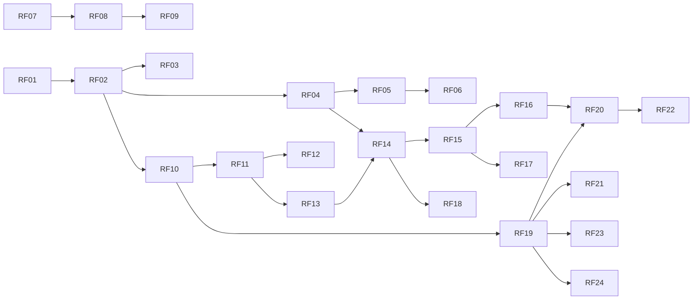

# Documento de Requisitos — ÁgoraHub

| Versão | Responsável     | Data       | Alterações                                                                 |
|--------|-----------------|------------|----------------------------------------------------------------------------|
| 1.0    | Equipe ÁgoraHub | 06/10/2026 | Criação do documento (seções 1 e 2)                                        |
| 1.1    | Equipe ÁgoraHub | 06/10/2026 | Seção 3: tipos de usuário, papéis e protopersonas                          |
| 1.2    | Equipe ÁgoraHub | 06/10/2026 | Seção 4: glossário                                                         |
| 1.3    | Equipe ÁgoraHub | 06/10/2026 | Seção 5: solução proposta                                                  |
| 1.4    | Equipe ÁgoraHub | 06/10/2026 | Seção 6: requisitos funcionais                                             |
| 1.5    | Equipe ÁgoraHub | 06/10/2026 | Seção 6.2: regras de negócio                                               |
| 1.6    | Equipe ÁgoraHub | 06/10/2026 | Seção 6.3: requisitos não funcionais                                       |
| 1.7    | Equipe ÁgoraHub | 06/10/2026 | Seção 7: versão completa                                                   |
| 1.8    | Equipe ÁgoraHub | 06/10/2026 | Edição de título e descrição do projeto no MVP; papéis do dono atualizados |

## 1. Introdução

Este documento apresenta os requisitos do aplicativo **ÁgoraHub**, projeto acadêmico das disciplinas de Projeto Integrador e Programação para Dispositivos Móveis (Sistemas de Informação, IFAL Arapiraca, 2026.2).

Os requisitos estão divididos em duas partes:

- **MVP do semestre:** o que a equipe vai construir até dezembro de 2026, com o que aprende nas aulas.
- **Versão completa:** o que o app precisaria ter para ser usado de verdade pelos estudantes. Fica registrado para não perder a visão do produto, mas não faz parte da entrega do semestre.

## 2. Propósito do sistema

No curso de Sistemas de Informação do IFAL Arapiraca, editais, bolsas, hackathons e eventos chegam aos estudantes espalhados por e-mails, murais e grupos de WhatsApp, e muitos só ficam sabendo depois do prazo. Formar equipe também é difícil: quem tem uma ideia não sabe quem tem interesse ou habilidade para ajudar, e muitos estudantes evitam abordar colegas que não conhecem. Além disso, boa parte da turma concilia os estudos com trabalho, família ou longos deslocamentos e passa pouco tempo no campus.

Em setembro de 2026, a equipe aplicou um questionário à comunidade acadêmica do curso e recebeu 33 respostas (31 estudantes e 2 professores ou membros da coordenação). Entre os respondentes:

- 10 já deixaram de participar de uma oportunidade por não encontrar colegas para formar equipe, e outros 9 por causa de avisos perdidos (5) ou porque souberam depois do prazo (4);
- 27 apontaram um mural com editais, vagas e desafios como uma das funcionalidades que mais os fariam usar a plataforma, e 20 escolheram a possibilidade de iniciar um projeto com outros estudantes;
- 21 preferem encontrar parceiros por interesse comum em áreas específicas, como desenvolvimento web, dados ou UX/UI;
- 17 conciliam os estudos com trabalho, família ou longos deslocamentos;
- 22 acham que a falta de ferramentas acessíveis atrapalha muito a integração dos alunos, e 10 que atrapalha um pouco; 2 respondentes usam recursos de acessibilidade e 21 conhecem colegas que precisam.

Nas respostas abertas, os participantes disseram que não usariam uma plataforma com excesso de informação ou parecida com os grupos de WhatsApp que já existem.

Como a amostra é pequena, esses números indicam tendências e não representam todo o curso.

O propósito do ÁgoraHub é reunir, num só aplicativo Android, **as oportunidades acadêmicas e a formação de equipes de projeto** entre estudantes do IFAL, organizadas por áreas de interesse, com o estudante no controle de quando o seu contato é compartilhado.

A pesquisa também mostrou que 17 respondentes têm dificuldade para tirar dúvidas sobre as disciplinas, por não saberem quem domina o assunto (9) ou por receio de perguntar em grupos grandes (8). Esse problema é real, mas não faz parte do foco do MVP e está registrado como possível evolução.

## 3. Usuários

### 3.1 Tipos de usuário

| Tipo de usuário | Descrição                                                                                                                                                                         | No MVP?               |
|-----------------|-----------------------------------------------------------------------------------------------------------------------------------------------------------------------------------|-----------------------|
| Estudante       | Aluno do IFAL com e-mail institucional (`@aluno.ifal.edu.br`). Consulta o Mural de Oportunidades, cria projetos no Hub de Projetos e pede para participar de projetos de colegas. | Sim                   |
| Equipe ÁgoraHub | Integrantes da equipe que mantêm o Mural de Oportunidades atualizado. No MVP, cadastram as oportunidades fora do aplicativo.                                                      | Sim, fora do app      |
| Administrador   | Publica e remove oportunidades pelo próprio aplicativo.                                                                                                                           | Não (versão completa) |
| Professor       | Divulga desafios e oportunidades e acompanha a participação dos estudantes.                                                                                                       | Não (versão completa) |

### 3.2 Papéis do estudante

O mesmo estudante pode assumir dois papéis, dependendo da situação:

| Papel           | Quando                                                    | O que pode fazer                                                                                                                                           |
|-----------------|-----------------------------------------------------------|------------------------------------------------------------------------------------------------------------------------------------------------------------|
| Dono do projeto | Quando cria um projeto                                    | Ver as solicitações recebidas, aceitar ou recusar, ver o e-mail dos membros, editar o título e a descrição, remover membros, reabrir e encerrar o projeto. |
| Solicitante     | Quando pede para participar do projeto de outro estudante | Enviar a solicitação e acompanhar o status.                                                                                                                |

### 3.3 Protopersonas

Pessoas fictícias criadas a partir da pesquisa, usadas para orientar as decisões do produto.

| Protopersona      | Quem é                                                                  | O que espera do ÁgoraHub                                                           | Atendida no MVP?                                                                                   |
|-------------------|-------------------------------------------------------------------------|------------------------------------------------------------------------------------|----------------------------------------------------------------------------------------------------|
| Marina, 21        | Estuda IA e UX por conta própria, mas não tem com quem montar projetos. | Saber das oportunidades a tempo e encontrar colegas com interesses complementares. | Sim                                                                                                |
| Pedro, 18         | Calouro tímido, não sabe como se aproximar dos grupos.                  | Entrar em projetos sem precisar dar o primeiro passo "no escuro".                  | Sim                                                                                                |
| John, 19          | Mora longe e passa pouco tempo no campus.                               | Se conectar com colegas e projetos sem depender de estar no campus.                | Sim                                                                                                |
| Isabela, 22       | Usa leitor de tela.                                                     | Um app acessível desde o primeiro acesso.                                          | Sim, com leitor de tela; a navegação completa por teclado fica para a versão completa              |
| Camila, 20        | Tem ansiedade social e evita se expor em grupos.                        | Se conectar aos poucos, sem exposição imediata.                                    | Em parte: pede para entrar num projeto de forma discreta; pedir ajuda com dúvidas fica fora do MVP |
| Roberta, 26       | Voltou de licença-maternidade e não conhece a turma nova.               | Encontrar parceiros e colaborar a distância.                                       | Em parte: encontra projetos por interesse; grupos de estudo ficam fora do MVP                      |
| Théo, 23          | Veterano que ajuda colegas pelo WhatsApp e se sente sobrecarregado.     | Um espaço organizado para oferecer ajuda.                                          | Não (versão completa)                                                                              |
| Prof. Ricardo, 41 | Professor que quer engajar os alunos em desafios.                       | Um canal para divulgar desafios e acompanhar a participação.                       | Não (versão completa)                                                                              |

## 4. Glossário

Termos usados neste documento, em ordem alfabética.

| Termo                  | Significado                                                                                                                                                                    |
|------------------------|--------------------------------------------------------------------------------------------------------------------------------------------------------------------------------|
| Dono do projeto        | Estudante que criou um projeto.                                                                                                                                                |
| E-mail institucional   | Endereço do domínio `@aluno.ifal.edu.br`. É o único aceito no cadastro de estudantes.                                                                                          |
| Hub de Projetos        | Lista dos projetos abertos que ainda têm vagas disponíveis.                                                                                                                    |
| Lista de tags          | Conjunto fixo de tags definido pela equipe. Os estudantes escolhem tags dessa lista, mas não podem criar, editar ou apagar tags.                                               |
| Membro do projeto      | Estudante cuja solicitação para participar de um projeto foi aceita e que não foi removido dele.                                                                               |
| Mural de Oportunidades | Tela inicial do app, com a lista de oportunidades.                                                                                                                             |
| MVP                    | Versão mínima do app, entregue no semestre 2026.2.                                                                                                                             |
| Oportunidade           | Edital, bolsa, hackathon, evento ou similar publicado no mural, com título, tipo, prazo, resumo, imagem e link para mais informações.                                          |
| Perfil                 | Nome, curso e de 3 a 5 tags do estudante. O estudante pode editar o perfil depois, marcando ou desmarcando tags da lista.                                                      |
| Prazo                  | Último dia para se inscrever ou participar de uma oportunidade. Em eventos sem inscrição, é a data do evento. A oportunidade fica visível no mural até o fim desse dia.        |
| Primeiro acesso        | Momento em que o estudante, depois de criar a conta, completa o perfil. Só então pode usar o app.                                                                              |
| Projeto                | Proposta criada por um estudante para formar equipe, com título, descrição, número de vagas e tags necessárias.                                                                |
| Solicitação            | Pedido de um estudante para participar de um projeto.                                                                                                                          |
| Solicitante            | Estudante que enviou uma solicitação.                                                                                                                                          |
| Status da solicitação  | **Pendente** (aguardando resposta do dono), **Aceita**, **Recusada** (com o motivo informado pelo dono) ou **Removida** (o dono removeu o membro do projeto).                  |
| Status do projeto      | **Aberto** (recebe solicitações), **Fechado** (todas as vagas foram preenchidas; o dono pode reabri-lo se uma vaga for liberada) ou **Encerrado** (o dono encerrou o projeto). |
| Tag                    | Área de habilidade ou interesse, como Mobile, UX/UI ou Banco de Dados. Usada no perfil dos estudantes e nos projetos.                                                          |
| Vagas disponíveis      | Número de vagas do projeto menos o número de solicitações aceitas.                                                                                                             |
| Versão completa        | Funcionalidades que fazem parte da visão do produto, mas ficam fora do MVP.                                                                                                    |

## 5. Solução proposta

O ÁgoraHub é um aplicativo Android com duas frentes principais:

- **Mural de Oportunidades:** reúne num só lugar editais, bolsas, hackathons e eventos, mostrando apenas os que ainda estão dentro do prazo, dos mais urgentes para os menos urgentes.
- **Hub de Projetos:** quem tem uma ideia cria um projeto com vagas e as tags de que precisa; quem quer participar encontra projetos pelas suas áreas de interesse e pede para entrar.

Quando o dono do projeto aceita uma solicitação, passa a ver o e-mail institucional do solicitante, e o contato continua fora do app.

### 5.1 Como o ÁgoraHub responde aos problemas

| Problema identificado                                                 | Como o ÁgoraHub responde                                                                                                                                      |
|-----------------------------------------------------------------------|---------------------------------------------------------------------------------------------------------------------------------------------------------------|
| Oportunidades espalhadas em e-mails, murais e grupos; prazos perdidos | Mural de Oportunidades com todas as oportunidades num só lugar, mostrando apenas as que ainda estão dentro do prazo, das mais urgentes para as menos urgentes |
| Dificuldade de encontrar colegas para formar equipe                   | Hub de Projetos com projetos que mostram as vagas e as tags necessárias, com filtro por tag                                                                   |
| Receio de abordar desconhecidos                                       | Pedido de participação com um toque, sem conversa pública; a recusa vem com um motivo pronto, sem exposição                                                   |
| Pouco tempo no campus                                                 | Tudo acontece pelo celular, no tempo de cada estudante                                                                                                        |
| Excesso de informação nos grupos de mensagens                         | Mural só com oportunidades cadastradas pela equipe, sem bate-papo e sem postagens livres                                                                      |
| Ferramentas pouco acessíveis                                          | Telas compatíveis com leitor de tela, com bom contraste e respeitando o tamanho de fonte do celular                                                           |
| Exposição de dados pessoais                                           | O e-mail do solicitante só é mostrado ao dono depois do aceite, e o solicitante é avisado disso antes de enviar o pedido                                      |

### 5.2 Principais funcionalidades do MVP

1. Cadastro e entrada no app com e-mail institucional.
2. Perfil com curso e de 3 a 5 tags, que o estudante pode editar depois.
3. Mural de Oportunidades, com os detalhes de cada oportunidade.
4. Criação de projetos.
5. Hub de Projetos, com filtro por tag e os detalhes de cada projeto.
6. Pedido de participação num projeto, com aviso sobre o compartilhamento do e-mail.
7. Resposta às solicitações recebidas (aceitar ou recusar com motivo) e acesso ao e-mail dos aceitos.
8. Acompanhamento das solicitações enviadas e dos projetos criados, incluindo editar o título e a descrição, remover membros, reabrir e encerrar projetos.

### 5.3 O que fica para a versão completa

Notificações no celular, recuperação de senha, filtro do mural por tipo de oportunidade, publicação de oportunidades por administradores e professores, vínculo entre um projeto e uma oportunidade do mural, cancelamento de pedidos, saída de membros de um projeto, e apoio para tirar dúvidas e formar grupos de estudo. Os detalhes estão na seção 7.

## 6. Requisitos do MVP

### 6.1 Requisitos funcionais

| Id.  | Descrição                                                                                                                                  | Prioridade | Depende de |
|------|--------------------------------------------------------------------------------------------------------------------------------------------|------------|------------|
| RF01 | Cadastrar uma conta com nome, e-mail institucional e senha.                                                                                | Alta       | —          |
| RF02 | Entrar no app com e-mail e senha.                                                                                                          | Alta       | RF01       |
| RF03 | Sair da conta.                                                                                                                             | Média      | RF02       |
| RF04 | Completar o perfil no primeiro acesso, informando o curso e escolhendo de 3 a 5 tags da lista de tags.                                     | Alta       | RF02       |
| RF05 | Visualizar o próprio perfil.                                                                                                               | Baixa      | RF04       |
| RF06 | Editar as tags do próprio perfil.                                                                                                          | Baixa      | RF05       |
| RF07 | Exibir o Mural de Oportunidades, com título, tipo, prazo e imagem de cada oportunidade.                                                    | Alta       | —          |
| RF08 | Exibir os detalhes de uma oportunidade: resumo e link para mais informações.                                                               | Alta       | RF07       |
| RF09 | Abrir o link de uma oportunidade no navegador do celular.                                                                                  | Média      | RF08       |
| RF10 | Criar um projeto, com título, descrição, número de vagas e tags necessárias.                                                               | Alta       | RF02       |
| RF11 | Exibir o Hub de Projetos, com título, vagas disponíveis e tags de cada projeto.                                                            | Alta       | RF10       |
| RF12 | Filtrar o Hub de Projetos por tag.                                                                                                         | Média      | RF11       |
| RF13 | Exibir os detalhes de um projeto: descrição, vagas disponíveis, tags e nome do dono.                                                       | Alta       | RF11       |
| RF14 | Solicitar participação num projeto, a partir dos detalhes dele, depois de confirmar o aviso de compartilhamento do e-mail.                 | Alta       | RF04, RF13 |
| RF15 | Exibir ao dono as solicitações recebidas, separadas por status, com as pendentes em primeiro lugar e o nome e as tags de cada solicitante. | Alta       | RF14       |
| RF16 | Aceitar uma solicitação pendente.                                                                                                          | Alta       | RF15       |
| RF17 | Recusar uma solicitação pendente, informando o motivo.                                                                                     | Alta       | RF15       |
| RF18 | Exibir ao estudante as solicitações que ele enviou, com o status de cada uma e o motivo, em caso de recusa.                                | Média      | RF14       |
| RF19 | Exibir ao dono os projetos que ele criou (Meus Projetos), com status, vagas disponíveis e vagas preenchidas.                               | Média      | RF10       |
| RF20 | Exibir ao dono os membros de um projeto dele, com nome, tags e e-mail institucional de cada um.                                            | Alta       | RF16, RF19 |
| RF21 | Encerrar um projeto.                                                                                                                       | Média      | RF19       |
| RF22 | Remover um membro de um projeto.                                                                                                           | Média      | RF20       |
| RF23 | Reabrir um projeto fechado.                                                                                                                | Média      | RF19       |
| RF24 | Editar o título e a descrição de um projeto.                                                                                               | Média      | RF19       |

#### 6.1.1 Diagrama de dependências

Cada seta vai do requisito que precisa existir antes para o requisito que depende dele.

### 6.2 Regras de negócio

A coluna **Relacionada a** indica os requisitos funcionais em que a regra se aplica.

| Id.  | Descrição                                                                                                                                                                                                                                                                | Prioridade | Relacionada a          |
|------|--------------------------------------------------------------------------------------------------------------------------------------------------------------------------------------------------------------------------------------------------------------------------|------------|------------------------|
| RN01 | Só e-mails do domínio `@aluno.ifal.edu.br` podem ser cadastrados.                                                                                                                                                                                                        | Alta       | RF01                   |
| RN02 | O estudante só acessa o Mural de Oportunidades, o Hub de Projetos e as solicitações depois de completar o perfil.                                                                                                                                                        | Alta       | RF04, RF07, RF11       |
| RN03 | As tags são escolhidas da lista de tags. Estudantes não podem criar, editar ou apagar tags da lista.                                                                                                                                                                     | Alta       | RF04, RF06, RF10, RF12 |
| RN04 | O perfil precisa ter de 3 a 5 tags, e o projeto, pelo menos 1 tag necessária.                                                                                                                                                                                            | Alta       | RF04, RF06, RF10       |
| RN05 | As oportunidades são cadastradas pela Equipe ÁgoraHub. Estudantes não publicam oportunidades.                                                                                                                                                                            | Média      | RF07                   |
| RN06 | O Mural de Oportunidades só mostra oportunidades dentro do prazo. A oportunidade fica visível até o fim do último dia do prazo.                                                                                                                                          | Média      | RF07                   |
| RN07 | O Mural de Oportunidades mostra as oportunidades da que tem o prazo mais próximo para a que tem o prazo mais distante.                                                                                                                                                   | Média      | RF07                   |
| RN08 | Todo projeto é criado com status Aberto e pelo menos 1 vaga. Quem cria o projeto é o dono dele.                                                                                                                                                                          | Alta       | RF10                   |
| RN09 | Vagas disponíveis = número de vagas do projeto − número de membros.                                                                                                                                                                                                      | Alta       | RF11, RF13, RF19       |
| RN10 | O Hub de Projetos mostra só projetos com status Aberto e com vagas disponíveis.                                                                                                                                                                                          | Alta       | RF11                   |
| RN11 | O dono não pode solicitar participação no próprio projeto.                                                                                                                                                                                                               | Alta       | RF14                   |
| RN12 | O estudante não pode enviar uma solicitação para um projeto se já tiver uma solicitação Pendente para ele, se já for membro dele ou se tiver sido removido dele. Depois de uma recusa, pode enviar uma nova solicitação, desde que o projeto apareça no Hub de Projetos. | Alta       | RF14                   |
| RN13 | A solicitação só é enviada depois que o estudante confirma o aviso: "Se sua solicitação for aceita, seu e-mail institucional será compartilhado com o dono do projeto."                                                                                                  | Alta       | RF14                   |
| RN14 | Uma solicitação Pendente pode ser aceita ou recusada. Uma solicitação Aceita pode passar a Removida. Recusada e Removida são status finais: não mudam mais.                                                                                                              | Alta       | RF16, RF17, RF22       |
| RN15 | Uma solicitação só pode ser aceita se o projeto tiver vagas disponíveis.                                                                                                                                                                                                 | Alta       | RF16                   |
| RN16 | Toda recusa feita pelo dono tem um motivo escolhido da lista: Perfil não compatível, Vagas preenchidas ou Outro. Ao escolher Outro, o dono precisa escrever o motivo. O solicitante vê o motivo.                                                                         | Média      | RF17, RF18             |
| RN17 | Quando as vagas disponíveis chegam a zero, o projeto passa para o status Fechado, e as solicitações pendentes dele são recusadas automaticamente com o motivo "Vagas preenchidas".                                                                                       | Alta       | RF16                   |
| RN18 | Ao remover um membro, a solicitação dele passa para Removida e a vaga volta a ficar disponível. O status do projeto não muda: um projeto Fechado continua Fechado até o dono reabri-lo.                                                                                  | Média      | RF22                   |
| RN19 | Só um projeto com status Fechado e com vagas disponíveis pode ser reaberto. Ao ser reaberto, ele volta para o status Aberto e reaparece no Hub de Projetos.                                                                                                              | Média      | RF23                   |
| RN20 | Ao encerrar um projeto, ele passa para o status Encerrado, e as solicitações pendentes dele são recusadas automaticamente com o motivo "Projeto encerrado". Um projeto Encerrado não pode ser reaberto.                                                                  | Média      | RF21                   |
| RN21 | O e-mail institucional de um estudante só é mostrado ao dono de um projeto do qual esse estudante é membro.                                                                                                                                                              | Alta       | RF20                   |
| RN22 | Solicitações não são apagadas: só mudam de status.                                                                                                                                                                                                                       | Baixa      | RF15, RF18             |
| RN23 | Só projetos com status Aberto ou Fechado podem ser editados. O título e a descrição não podem ficar vazios.                                                                                                                                                              | Média      | RF24                   |

### 6.3 Requisitos não funcionais

A coluna **Como verificar** indica como confirmar que o requisito foi atendido.

| Id.   | Descrição                                                                                                                                                                                                                     | Categoria                        | Prioridade | Como verificar                                                                                                |
|-------|-------------------------------------------------------------------------------------------------------------------------------------------------------------------------------------------------------------------------------|----------------------------------|------------|---------------------------------------------------------------------------------------------------------------|
| RNF01 | Imagens e ícones que informam algo têm uma descrição lida pelo leitor de tela. Imagens e ícones só decorativos são ignorados por ele.                                                                                         | Produto / Usabilidade            | Alta       | Navegar pelas telas com o TalkBack ligado: cada imagem e ícone importante é lido com um nome que faz sentido. |
| RNF02 | Os textos têm contraste mínimo de 4,5:1 com o fundo (3:1 para textos grandes), conforme o nível AA das diretrizes WCAG.                                                                                                       | Produto / Usabilidade            | Alta       | O app Accessibility Scanner não mostra alertas de contraste.                                                  |
| RNF03 | Os textos respeitam o tamanho de fonte escolhido nas configurações do celular, sem cortar conteúdo.                                                                                                                           | Produto / Usabilidade            | Alta       | Com a fonte do celular no tamanho máximo, todos os textos aparecem inteiros.                                  |
| RNF04 | Botões e outros elementos tocáveis têm área de toque de pelo menos 48 dp.                                                                                                                                                     | Produto / Usabilidade            | Média      | O app Accessibility Scanner não mostra alertas de área de toque.                                              |
| RNF05 | Os textos usam linguagem simples. Mensagens de erro aparecem escritas junto ao campo com problema, nunca indicadas só por cor.                                                                                                | Produto / Usabilidade            | Média      | Revisão das telas: todo erro aparece como texto.                                                              |
| RNF06 | A senha fica oculta durante a digitação.                                                                                                                                                                                      | Produto / Proteção               | Média      | Ao digitar a senha, aparecem pontos no lugar dos caracteres.                                                  |
| RNF07 | O app coleta só nome, e-mail institucional, curso e tags, e a tela de cadastro informa para que esses dados são usados, conforme a LGPD.                                                                                      | Externo / Legislativo            | Alta       | Revisão da tela de cadastro.                                                                                  |
| RNF08 | O app é Android nativo, desenvolvido em Kotlin com Jetpack Compose, e funciona no Android 7.0 (API 24) ou superior.                                                                                                           | Organizacional / Desenvolvimento | Alta       | Configuração do projeto no arquivo `build.gradle.kts`.                                                        |
| RNF09 | O desenvolvimento é incremental, em iterações, usando prioritariamente os conceitos vistos na disciplina. Uma tecnologia nova só entra se for indispensável para um requisito do MVP, e a decisão fica registrada na seção 9. | Organizacional / Desenvolvimento | Alta       | Comparação entre o código, o plano de iterações e as decisões registradas.                                    |
| RNF10 | O código fica no GitHub, com uma branch por tarefa, e o README descreve só o que existe no repositório.                                                                                                                       | Organizacional / Desenvolvimento | Média      | Revisão do repositório.                                                                                       |
| RNF11 | O MVP está funcionando na apresentação final (08/12 ou 15/12/2026), com entrega final em 17/12/2026.                                                                                                                          | Organizacional / Entrega         | Alta       | Demonstração na apresentação final.                                                                           |

## 7. Requisitos da versão completa

Funcionalidades que fazem parte da visão do produto, mas não serão desenvolvidas no semestre. Esta lista não é um compromisso, e a ordem dos itens não indica prioridade. Se a equipe decidir trazer um item para o MVP, ele passa a ser um requisito da seção 6, com um novo identificador.

### 7.1 Acesso e perfil

| Id.  | Descrição                                                                                                               | Por que fica para depois                                              |
|------|-------------------------------------------------------------------------------------------------------------------------|-----------------------------------------------------------------------|
| VC01 | Verificação do e-mail institucional por um link enviado no cadastro, para confirmar que o estudante é dono do endereço. | Depende de um serviço de envio de e-mails.                            |
| VC02 | Recuperação de senha.                                                                                                   | Depende de um serviço de envio de e-mails.                            |
| VC03 | Exclusão da própria conta e dos dados pessoais, conforme a LGPD.                                                        | Envolve apagar ou anonimizar dados ligados a projetos e solicitações. |
| VC04 | Separação de usuários e conteúdo por curso, para que o app possa ser usado por outros cursos.                           | O MVP atende apenas Sistemas de Informação.                           |
| VC05 | Disponibilidade de horários no perfil do estudante.                                                                     | Acrescenta campos e telas que não são essenciais ao fluxo principal.  |

### 7.2 Mural de Oportunidades

| Id.  | Descrição                                                       | Por que fica para depois                                        |
|------|-----------------------------------------------------------------|-----------------------------------------------------------------|
| VC06 | Filtro do mural por tipo de oportunidade.                       | Com poucas oportunidades, a ordenação pelo prazo já basta.      |
| VC07 | Publicação de oportunidades por administradores, dentro do app. | Exige um novo tipo de usuário, com permissões e telas próprias. |

### 7.3 Projetos e solicitações

| Id.  | Descrição                                                                                                                                 | Por que fica para depois                                                       |
|------|-------------------------------------------------------------------------------------------------------------------------------------------|--------------------------------------------------------------------------------|
| VC08 | Vínculo entre um projeto e uma oportunidade do mural ("procuro equipe para este hackathon").                                              | Liga as duas frentes do app, mas amplia o modelo de dados.                     |
| VC09 | Horário de encontro no projeto e o motivo de recusa "Horários incompatíveis".                                                             | Depende da VC05.                                                               |
| VC10 | Cancelamento de uma solicitação pendente pelo solicitante.                                                                                | Acrescenta um novo status de solicitação.                                      |
| VC11 | Saída de um membro do projeto por conta própria.                                                                                          | Acrescenta um novo status de solicitação.                                      |
| VC12 | Justificativa ao remover um membro.                                                                                                       | Melhoria de comunicação; a remoção já funciona sem ela.                        |
| VC13 | Edição das vagas e das tags de um projeto.                                                                                                | Exige regras para quando o número de vagas fica menor que o número de membros. |
| VC14 | Justificativa ao encerrar um projeto: não completou as vagas, desistência ou concluído, com link para o site ou repositório do resultado. | Ganha valor junto com o acompanhamento por professores (VC17).                 |
| VC15 | Reabertura de um projeto encerrado.                                                                                                       | Depende de como ficarão os status com a VC14.                                  |

### 7.4 Comunicação

| Id.  | Descrição                                                                                          | Por que fica para depois                        |
|------|----------------------------------------------------------------------------------------------------|-------------------------------------------------|
| VC16 | Notificações no celular: nova solicitação, mudança de status e lembrete de prazo de oportunidades. | Depende de um serviço de envio de notificações. |

### 7.5 Comunidade e professores

| Id.  | Descrição                                                                               | Por que fica para depois                                        |
|------|-----------------------------------------------------------------------------------------|-----------------------------------------------------------------|
| VC17 | Perfil de professor, para divulgar desafios e acompanhar a participação dos estudantes. | Exige um novo tipo de usuário, com permissões e telas próprias. |
| VC18 | Apoio para tirar dúvidas e formar grupos de estudo.                                     | É outro problema da pesquisa, fora do foco do MVP.              |

### 7.6 Acessibilidade

| Id.  | Descrição                                                             | Por que fica para depois                                                                                                 |
|------|-----------------------------------------------------------------------|--------------------------------------------------------------------------------------------------------------------------|
| VC19 | Uso completo do app por teclado físico e pelo Acesso com Interruptor. | Exige testes com equipamentos e configurações específicas; o MVP cobre leitor de tela, contraste, fonte e área de toque. |

## 8. Principais funcionalidades

*Em construção.*

## 9. Decisões em aberto

*Em construção.*